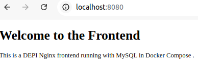
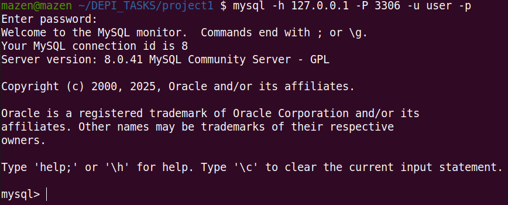

# Dockerized Nginx Frontend with MySQL

This project demonstrates how to set up a simple Docker Compose environment with Nginx serving a static HTML page and MySQL as the backend database.       

## How to Run

1. **Clone the repository**:
   ```bash
   git clone https://github.com/your-username/your-repo-name.git
   cd your-repo-name
2. **Build and start the containers**:
    ```bash
    docker-compose up --build
3. **Access the frontend**: Open your browser and go to http://localhost:8080

4. **Connect to MySQL**: Use a MySQL client with the following credentials:

    Host: 127.0.0.1

    Port: 3306

    User: user

    Password: userpassword

    Database: testdb


## Screenshots
**Frontend Connection**:



**MySQL Connection**:

